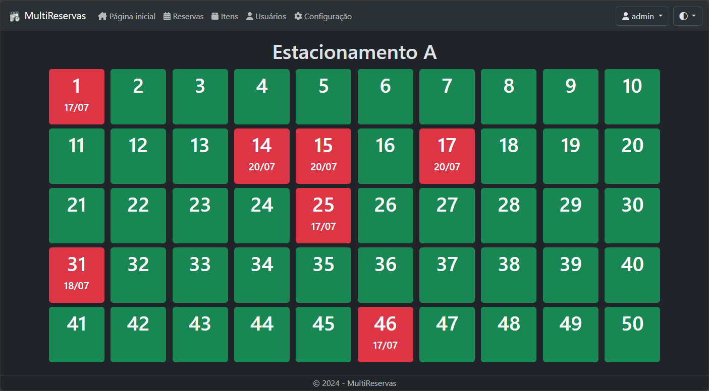
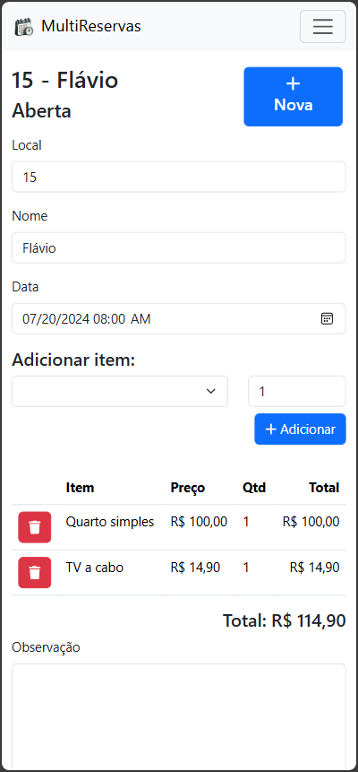

# MultiReservas

Um sistema construído em .NET 8 para reserva de locais, alguns exemplos de uso são: restaurantes, hotéis, cinemas e estacionamentos. Pode ser utilizado também como um sistema de pedidos simples.

O sistema também é responsivo ao tamanho da tela e tema claro/escuro do dispositivo.

A quantidade de locais pode ser alterada nas configurações do sistema, assim como o limite de reservas por local, permitindo multiplas reservas, útil para restaurantes com mais de uma comanda ou reservas futuras. 

## Como executar

### Pré-requisito

- [.NET 8.0](https://dotnet.microsoft.com/pt-br/download/dotnet/8.0)
 
### Instruções

- Baixe o sistema e descompacte: [MultiReservas.zip](https://github.com/flaviobertoluchi/MultiReservas/blob/master/MultiReservas.zip)
- Execute o sistema abrindo o arquivo MultiReservas.exe ou MultiReservas.dll dependendo do sistema operacional.
- Abra o link gerado no navegador, utilize o usuário **admin** com senha **admin**.

#### Banco de dados (opcional)

- O sistema pode ser executado em um dos seguintes bancos:

  - [SQLite](https://www.sqlite.org/download.html) (Padrão, já configurado)
  - [SQL Server](https://www.microsoft.com/pt-br/sql-server/sql-server-downloads)
  - [Oracle Database](https://www.oracle.com/br/database/free/get-started/)
  - [PostgreSQL](https://www.postgresql.org/download/)
  - [MySQL](https://dev.mysql.com/downloads/)

- Escolha um provedor de banco de dados e crie o banco, execute o script de criação das tabelas correspondente encontrado em [Scripts](https://github.com/flaviobertoluchi/MultiReservas/tree/master/MultiReservas/Scripts)
- Defina o banco na tag "Banco" do arquivo [appsettings.json](https://github.com/flaviobertoluchi/MultiReservas/blob/master/MultiReservas/appsettings.json), o arquivo contém exemplos de ConnectionStrings para cada banco, configure a do banco escolhido.
