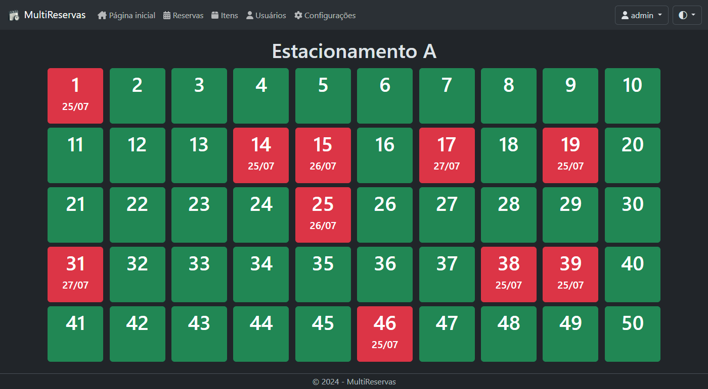

# MultiReservas

Um sistema construído em .NET 8 para reserva de locais, alguns exemplos de uso são: restaurantes, hotéis, cinemas e estacionamentos. Pode ser utilizado também como um sistema de pedidos simples.



A quantidade de locais e o limite de reservas por local podem ser alterados nas configurações do sistema. Permitindo multiplas reservas, útil para restaurantes com mais de uma comanda ou reservas futuras. 


O sistema também é responsivo ao tamanho da tela e ao tema (claro/escuro) do dispositivo.


## Como executar

#### Windows

- Baixe e descompacte: [MultiReservas - Windows](https://github.com/flaviobertoluchi/MultiReservas/releases/latest/download/MultiReservas.Windows.x64.zip)
- Abra o arquivo `MultiReservas.exe`

#### Linux

- Baixe e descompacte: [MultiReservas - Linux](https://github.com/flaviobertoluchi/MultiReservas/releases/latest/download/MultiReservas.Linux.amd64.zip)
- Permita a execução dos arquivos `MultiReservas` e `MultiReservas.sh`.
  ```
  chmod +x MultiReservas MultiReservas.sh
  ```
- Abra o arquivo `MultiReservas.sh`

#### .NET (Linux, macOS e Windows)

- Baixe e instale: [.NET 8.0](https://dotnet.microsoft.com/pt-br/download/dotnet/8.0)
- Baixe e descompacte: [MultiReservas](https://github.com/flaviobertoluchi/MultiReservas/releases/latest/download/MultiReservas.dotNET8.zip)
- No terminal execute o comando:
  ```
  dotnet MultiReservas.dll
  ```

### Acesso ao sistema

- Acesse no navegador http://localhost:5000, utilize o usuário **admin** com senha **admin**.

### Banco de dados (Opcional)

- O sistema pode ser executado em um dos seguintes bancos:

  - [SQLite](https://www.sqlite.org/download.html) (Padrão, já configurado)
  - [SQL Server](https://www.microsoft.com/pt-br/sql-server/sql-server-downloads)
  - [Oracle Database](https://www.oracle.com/br/database/free/get-started/)
  - [PostgreSQL](https://www.postgresql.org/download/)
  - [MySQL](https://dev.mysql.com/downloads/)

- Crie o banco e execute o script de criação das tabelas encontrado em [Scripts](https://github.com/flaviobertoluchi/MultiReservas/tree/master/MultiReservas/Scripts).
- Defina o banco na tag "Banco" do arquivo [appsettings.json](https://github.com/flaviobertoluchi/MultiReservas/blob/master/MultiReservas/appsettings.json), o arquivo contém exemplos de ConnectionStrings para cada banco.
